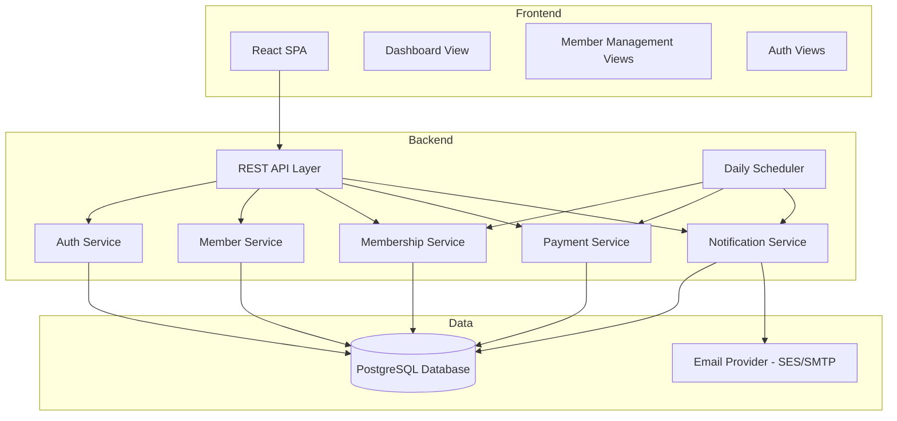
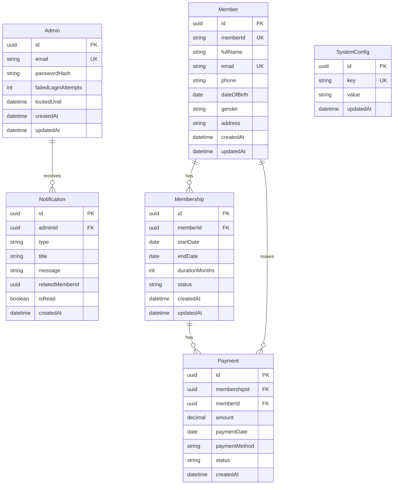

# Design Document: Gym Management System

## Overview

The Gym Management System is a cloud-based web application that provides gym administrators with tools to register members, manage memberships, track payments, and receive notifications about membership expiry and payment status. The system follows a layered architecture with a React-based frontend, a RESTful API backend, a relational database for persistence, and a notification service for email and in-app alerts.

Key design goals:
- Clean separation between presentation, business logic, and data layers
- Automated daily evaluation of membership statuses with configurable notification windows
- Reliable notification delivery with retry logic
- Secure admin authentication with brute-force protection

## Architecture

The system uses a three-tier architecture:



### Technology Stack

| Layer | Technology |
|-------|-----------|
| Frontend | React with TypeScript |
| Backend API | Node.js with Express |
| Database | PostgreSQL |
| ORM | Prisma |
| Authentication | JWT with bcrypt password hashing |
| Email | AWS SES or SMTP provider |
| Scheduler | node-cron for daily evaluations |
| Validation | Zod for request validation |
| Testing | Vitest + fast-check for property-based testing |

## Components and Interfaces

### 1. Auth Service

Handles admin authentication, session management, and account lockout.

```typescript
interface AuthService {
  login(email: string, password: string): Promise<{ token: string; admin: AdminProfile }>;
  validateToken(token: string): Promise<AdminProfile>;
  lockAccount(adminId: string): Promise<void>;
  unlockAccount(adminId: string): Promise<void>;
  getFailedAttempts(adminId: string): Promise<number>;
}
```

### 2. Member Service

Manages member registration, retrieval, search, and listing.

```typescript
interface MemberService {
  register(data: MemberRegistrationInput): Promise<Member>;
  getById(memberId: string): Promise<Member | null>;
  search(query: SearchQuery): Promise<PaginatedResult<MemberListItem>>;
  list(filters: MemberFilters, pagination: Pagination): Promise<PaginatedResult<MemberListItem>>;
}

interface MemberRegistrationInput {
  fullName: string;
  email: string;
  phone: string;
  dateOfBirth: Date;
  gender: 'male' | 'female' | 'other';
  address: string;
}

interface SearchQuery {
  term: string; // searches name, email, or member ID
  membershipStatus?: MembershipStatus;
  paymentStatus?: PaymentStatus;
  pagination: Pagination;
}

interface MemberFilters {
  membershipStatus?: MembershipStatus;
  paymentStatus?: PaymentStatus;
}
```

### 3. Membership Service

Manages membership creation, renewal, status evaluation, and expiry tracking.

```typescript
interface MembershipService {
  create(memberId: string, data: MembershipCreateInput): Promise<Membership>;
  renew(membershipId: string, duration: MembershipDuration): Promise<Membership>;
  evaluateStatuses(): Promise<StatusEvaluationResult>;
  getByMemberId(memberId: string): Promise<Membership | null>;
  getStatusCounts(): Promise<MembershipStatusCounts>;
}

interface MembershipCreateInput {
  startDate: Date;
  duration: MembershipDuration;
}

type MembershipDuration = 1 | 3 | 6 | 12; // months

interface StatusEvaluationResult {
  newlyExpiringSoon: string[]; // member IDs
  newlyExpired: string[];      // member IDs
  totalEvaluated: number;
}

interface MembershipStatusCounts {
  active: number;
  expiringSoon: number;
  expired: number;
}
```

### 4. Payment Service

Records payments, tracks payment status, and manages overdue detection.

```typescript
interface PaymentService {
  record(memberId: string, data: PaymentRecordInput): Promise<Payment>;
  evaluateOverdue(): Promise<OverdueEvaluationResult>;
  getByMembershipId(membershipId: string): Promise<Payment[]>;
  getPaymentSummary(): Promise<PaymentSummary>;
}

interface PaymentRecordInput {
  amount: number;
  paymentDate: Date;
  paymentMethod: 'cash' | 'card' | 'online_transfer';
  membershipId: string;
}

interface PaymentSummary {
  totalCollected: number;
  pendingCount: number;
  overdueCount: number;
}
```

### 5. Notification Service

Sends email and in-app notifications with retry logic.

```typescript
interface NotificationService {
  sendEmail(to: string, template: EmailTemplate, data: Record<string, unknown>): Promise<void>;
  createInAppNotification(adminId: string, notification: InAppNotificationInput): Promise<void>;
  getInAppNotifications(adminId: string, pagination: Pagination): Promise<PaginatedResult<InAppNotification>>;
  configureExpiryWindow(days: number): Promise<void>;
  getExpiryWindow(): Promise<number>;
}

interface InAppNotificationInput {
  type: NotificationType;
  title: string;
  message: string;
  relatedMemberId?: string;
}

type NotificationType =
  | 'membership_expiring_soon'
  | 'membership_expired'
  | 'payment_overdue'
  | 'payment_received';

type EmailTemplate =
  | 'welcome'
  | 'membership_expiring'
  | 'membership_expired'
  | 'payment_confirmation'
  | 'payment_overdue_reminder';
```

### 6. Daily Scheduler

Runs automated daily evaluations for membership status and payment status.

```typescript
interface DailyScheduler {
  start(): void;
  stop(): void;
  runEvaluation(): Promise<DailyEvaluationResult>;
}

interface DailyEvaluationResult {
  membershipEvaluation: StatusEvaluationResult;
  overdueEvaluation: OverdueEvaluationResult;
  notificationsSent: number;
  errors: string[];
}
```

### 7. Dashboard Service

Aggregates data for the admin dashboard.

```typescript
interface DashboardService {
  getSummary(): Promise<DashboardSummary>;
  getMembersByStatus(status: MembershipStatus, pagination: Pagination): Promise<PaginatedResult<MemberListItem>>;
}

interface DashboardSummary {
  totalMembers: number;
  membershipCounts: MembershipStatusCounts;
  paymentSummary: PaymentSummary;
  recentNotifications: InAppNotification[];
}
```

## Data Models



### Enumerations

```typescript
enum MembershipStatus {
  Active = 'active',
  ExpiringSoon = 'expiring_soon',
  Expired = 'expired',
}

enum PaymentStatus {
  Paid = 'paid',
  Pending = 'pending',
  Overdue = 'overdue',
}

enum PaymentMethod {
  Cash = 'cash',
  Card = 'card',
  OnlineTransfer = 'online_transfer',
}

enum Gender {
  Male = 'male',
  Female = 'female',
  Other = 'other',
}
```

### Key Business Rules

1. **Membership end date calculation**: `endDate = startDate + durationMonths`
2. **Membership status transitions**:
   - `Active` → `Expiring_Soon` when `endDate - currentDate <= expiryWindow`
   - `Expiring_Soon` → `Expired` when `currentDate > endDate`
   - `Expired` → `Active` when membership is renewed
3. **Payment status transitions**:
   - `Pending` (default on membership creation without payment)
   - `Pending` → `Paid` when payment is recorded
   - `Pending` → `Overdue` when membership start date + 7 days < current date
4. **Account lockout**: Lock after 5 consecutive failed login attempts for 15 minutes
5. **Email retry**: Up to 3 retries with exponential backoff (e.g., 1s, 2s, 4s)
6. **Overdue reminders**: Repeat every 7 days while payment remains overdue


## Correctness Properties

*A property is a characteristic or behavior that should hold true across all valid executions of a system — essentially, a formal statement about what the system should do. Properties serve as the bridge between human-readable specifications and machine-verifiable correctness guarantees.*

### Property 1: Member registration creates a unique record

*For any* valid member registration input (with non-empty full name, valid email, phone, date of birth, gender, and address), registering the member SHALL produce a new Member record with a unique member ID that is distinct from all previously assigned IDs.

**Validates: Requirements 1.2**

### Property 2: Registration validation rejects missing required fields

*For any* registration input where one or more required fields (full name, email, phone, date of birth, gender, address) are missing or empty, the system SHALL reject the registration and return validation errors that identify exactly the missing fields.

**Validates: Requirements 1.3**

### Property 3: Duplicate email rejection

*For any* successfully registered member, attempting to register a new member with the same email address SHALL be rejected with a duplicate email error, regardless of other field values.

**Validates: Requirements 1.4**

### Property 4: Membership end date calculation

*For any* valid start date and membership duration (1, 3, 6, or 12 months), the calculated end date SHALL equal the start date plus exactly the specified number of months.

**Validates: Requirements 2.2**

### Property 5: New membership status is Active when current date is in range

*For any* newly created membership where the current date falls between the start date and end date (inclusive), the membership status SHALL be set to Active.

**Validates: Requirements 2.3**

### Property 6: Membership renewal extends from correct base date

*For any* active membership, renewal SHALL calculate the new end date by extending from the current end date. *For any* expired membership, renewal SHALL calculate the new end date by extending from the current date. In both cases, the extension SHALL equal the specified renewal duration in months.

**Validates: Requirements 2.5**

### Property 7: Membership status evaluation correctness

*For any* set of memberships with known start dates, end dates, and a configured expiry window, running the daily status evaluation SHALL:
- Set status to `Expiring_Soon` for all memberships where `0 < (endDate - currentDate) <= expiryWindow`
- Set status to `Expired` for all memberships where `currentDate > endDate`
- Leave status as `Active` for all memberships where `(endDate - currentDate) > expiryWindow`

**Validates: Requirements 3.1, 3.2**

### Property 8: Payment recording stores all fields with Paid status

*For any* valid payment input (positive amount, valid date, valid payment method, and valid membership ID), recording the payment SHALL create a Payment record that preserves all input fields and sets the payment status to Paid.

**Validates: Requirements 5.1, 5.2**

### Property 9: Default Pending payment status for unpaid memberships

*For any* newly created membership that has no associated payment, the payment status SHALL be Pending.

**Validates: Requirements 5.3**

### Property 10: Overdue payment status transition

*For any* membership with a Pending payment status where the membership start date is more than 7 days before the current date, running the payment evaluation SHALL update the payment status to Overdue.

**Validates: Requirements 5.4**

### Property 11: Dashboard summary accuracy

*For any* set of members, memberships, and payments in the system, the dashboard summary SHALL report:
- Total registered members equal to the actual count of member records
- Active, Expiring_Soon, and Expired membership counts equal to the actual count of memberships in each status
- Total payments collected equal to the sum of all Paid payment amounts
- Pending and overdue payment counts equal to the actual count of payments in each status

**Validates: Requirements 3.4, 5.6, 7.1**

### Property 12: Notification chronological ordering

*For any* set of in-app notifications with distinct creation timestamps, retrieving notifications SHALL return them sorted in descending order by creation timestamp (most recent first).

**Validates: Requirements 7.3**

### Property 13: Member listing data completeness

*For any* registered member with an associated membership and payment, the member listing SHALL include the member's name, email, current membership status, and current payment status.

**Validates: Requirements 8.1**

### Property 14: Member search matches by name, email, or member ID

*For any* search query string and set of registered members, the search results SHALL include all members whose name, email, or member ID contains the search query (case-insensitive), and SHALL exclude all members where none of these fields match.

**Validates: Requirements 8.2**

### Property 15: Member filtering by status

*For any* set of registered members and any selected membership status or payment status filter, the filtered results SHALL contain exactly the members whose corresponding status matches the filter, with no omissions and no false inclusions.

**Validates: Requirements 7.2, 8.3, 8.4**

### Property 16: Invalid credentials are denied

*For any* admin account and any password that does not match the stored password, authentication SHALL fail and access SHALL be denied.

**Validates: Requirements 9.3**

### Property 17: Account lockout after consecutive failures

*For any* admin account, after exactly 5 consecutive failed authentication attempts, the account SHALL be locked. While locked, even valid credentials SHALL be rejected. The lock SHALL expire after 15 minutes.

**Validates: Requirements 9.4**

### Property 18: Password validation

*For any* string, the password validator SHALL accept it if and only if it has at least 8 characters, contains at least one uppercase letter, at least one lowercase letter, at least one digit, and at least one special character.

**Validates: Requirements 9.5**

## Error Handling

### Input Validation Errors
- All API endpoints validate input using Zod schemas before processing
- Validation errors return HTTP 400 with a structured error response listing all invalid fields
- Registration form validates email format, phone format, and required field presence

### Authentication Errors
- Invalid credentials return HTTP 401 with a generic "Invalid email or password" message (no information leakage)
- Locked accounts return HTTP 423 with a message indicating the account is locked and the remaining lockout duration
- Expired or invalid JWT tokens return HTTP 401, requiring re-authentication

### Business Logic Errors
- Duplicate email registration returns HTTP 409 (Conflict)
- Membership creation for a non-existent member returns HTTP 404
- Payment recording for a non-existent membership returns HTTP 404
- Renewal of a membership that doesn't exist returns HTTP 404

### Notification Failures
- Email delivery failures are logged with full error details
- Failed emails are retried up to 3 times with exponential backoff (1s, 2s, 4s delays)
- After 3 failed retries, the failure is logged as a permanent failure and an in-app notification is created for the admin
- In-app notification creation failures are logged but do not block the triggering operation

### Scheduler Errors
- Daily evaluation errors are logged with full context
- Individual membership/payment evaluation failures do not halt the batch — the scheduler continues processing remaining records
- A summary of successes and failures is logged after each evaluation run

### Database Errors
- Connection failures trigger automatic reconnection with backoff
- Transaction failures are rolled back and the operation returns HTTP 500
- Unique constraint violations (e.g., duplicate email) are caught and returned as HTTP 409

## Testing Strategy

### Unit Tests
- **Validation logic**: Test Zod schemas with valid and invalid inputs for all endpoints
- **Date calculations**: Test end date calculation for all duration options, including edge cases (month boundaries, leap years)
- **Status transitions**: Test individual status transition functions with specific date scenarios
- **Password validation**: Test password validator with specific valid and invalid passwords
- **Email retry logic**: Test retry mechanism with mocked email service failures
- **Account lockout**: Test lockout counter increment, threshold detection, and unlock timing

### Property-Based Tests (fast-check)
- **Library**: fast-check (TypeScript property-based testing library)
- **Minimum iterations**: 100 per property test
- **Tag format**: `Feature: gym-management, Property {number}: {property_text}`
- Each of the 18 correctness properties above will be implemented as a property-based test
- Generators will produce random valid/invalid member data, dates, payment amounts, search queries, and credential combinations
- Focus areas:
  - Member registration and validation (Properties 1-3)
  - Membership date calculations and status evaluation (Properties 4-7)
  - Payment recording and status transitions (Properties 8-10)
  - Dashboard aggregation accuracy (Property 11)
  - Search, filtering, and listing (Properties 12-15)
  - Authentication and security (Properties 16-18)

### Integration Tests
- **API endpoint tests**: Test full request/response cycle for all REST endpoints
- **Database integration**: Test Prisma queries against a test PostgreSQL instance
- **Notification flow**: Test end-to-end notification delivery with mocked email provider
- **Daily scheduler**: Test full evaluation cycle with realistic data sets
- **Authentication flow**: Test login, token validation, and protected route access

### End-to-End Tests
- **Member lifecycle**: Register → Create membership → Record payment → View on dashboard
- **Expiry flow**: Create membership near expiry → Run evaluation → Verify notifications
- **Payment overdue flow**: Create membership without payment → Advance time → Verify overdue notifications
- **Admin authentication**: Login → Access dashboard → Logout → Verify access denied
